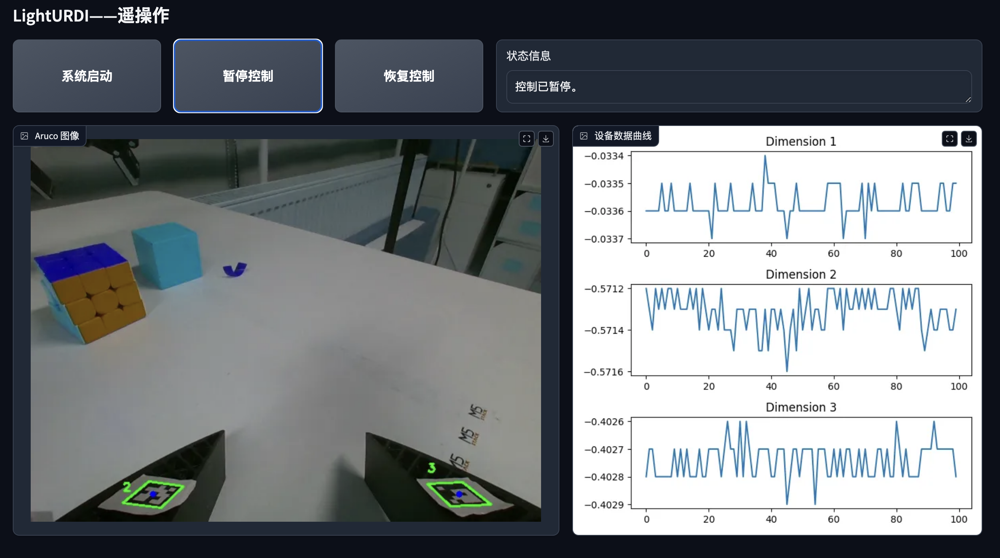

<div align=center> </div>

<div align="center">

# Welcome to LightURDI

</div>


📖 **LightURDI: 一个低成本、便携的遥操作与人类演示数据采集系统**



## Release

- [x] **`2025.03.12`** 🔥Release the LightURDI base code.


## Get Started


### 1.Clone & Install

```shell
git clone git@github.com:unira-zwj/LightURDI.git
```

你需要预先安装ROS2

---


### 2.Start the pos pub node

```shell
bash start_env.sh
```


### 3.Start robot arm tele opration

```shell
python ur3_follow_with_web_ui
```

## Main Contributors

- [Weijie Zhou](https://github.com/unira-zwj)
- [Yi Peng]()

## Acknowledgement

- [UMI](https://github.com/real-stanford/universal_manipulation_interface)
- [FastUMI](https://github.com/YdingTeam/FastUMI_Data)

## Citation
If you find LightURDI useful for your research and applications, please cite using this BibTeX:
```bibtex
