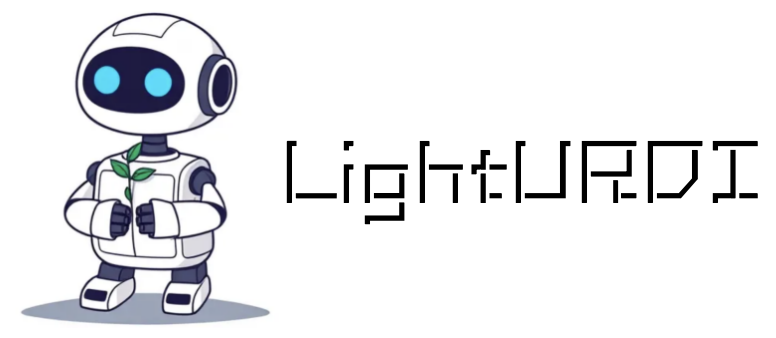
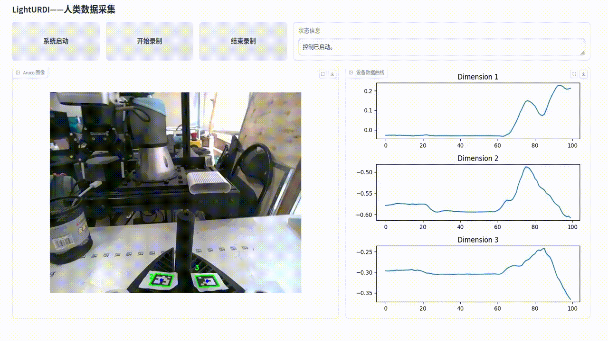

<div align=center> </div>

<div align="center">

# Welcome to LightURDI

</div>


📖 **LightURDI: A Low-Cost, Portable Data Collection System for Teleoperation and Human Demonstration**

Human Demonstration



Teleoperation


## Release

- [ ] **TODO** Release our paper
- [ ] **TODO** Action policy training code
- [ ] **TODO** Surpport for new robot, like XArm6 and ALOHA. 
- [x] **`2025.03.12`** 🔥Release the LightURDI base code.


## Get Started

### 1.Clone & Install

```shell
git clone git@github.com:unira-zwj/LightURDI.git
```

You should pre-install ROS2.

---


### 2.Start the pos pub node

```shell
bash start_env.sh
```


### 3.Start robot arm tele opration

```shell
python ur3_follow_with_web_ui
```

## Main Contributors

- [Weijie Zhou](https://github.com/unira-zwj)
- [Yi Peng]()

## Acknowledgement

- [UMI](https://github.com/real-stanford/universal_manipulation_interface)
- [FastUMI](https://github.com/YdingTeam/FastUMI_Data)

## Citation
If you find LightURDI useful for your research and applications, please cite using this BibTeX:
```bibtex
